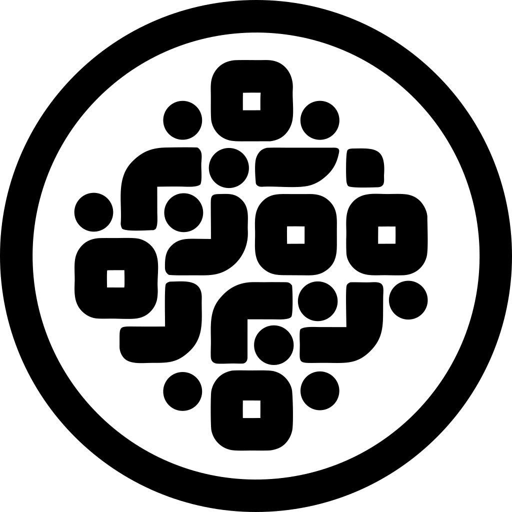

<div align="center">
  
  <p>
    <a href="https://github.com/engels74/open-island/releases/latest">
      
    </a>
    <a href="https://github.com/engels74/open-island/releases">
      
    </a>
    <a href="https://opensource.org/licenses/AGPL-3.0">
      
    </a>
    <a href="#">
      
    </a>
    <a href="https://deepwiki.com/engels74/open-island">
      
    </a>
  </p>
  <h3 align="center">Open Island</h3>
  <p align="center">
    Provider-agnostic macOS notch overlay for monitoring CLI/TUI coding agents.
  </p>
</div>

open-island sits in your MacBook's notch area and gives you live visibility
into what your coding agents are doing — active sessions, permission requests
(camera, microphone, screen recording, accessibility), token usage, and more.

## Supported Providers

- **Claude Code** (Anthropic)
- **Codex CLI** (OpenAI)
- **Gemini CLI** (Google)
- **OpenCode**

## Features

- **Notch overlay UI** — unobtrusive status display anchored to the macOS notch
- **Permission interception** — intercept and manage camera, microphone, screen
  recording, and accessibility permission requests
- **Session monitoring** — track active agent sessions, token usage, and costs
- **Multi-provider support** — unified interface across different coding agent CLIs
- **Terminal detection** — automatically discover agent sessions running in
  your terminals

## Requirements

- macOS 16.0+
- Xcode 17
- Swift 6.2

## Getting Started

### Install tools

```sh
brew install just swiftformat swiftlint
```

Verify everything is set up:

```sh
just check-tools
```

### Build

```sh
just build
```

### Test

```sh
just test
```

### Other commands

```sh
just --list          # show all available recipes
just build-release   # release build
just lint            # SwiftLint strict mode
just format          # auto-format with SwiftFormat
just quality         # run all code quality checks
just clean           # remove build artifacts
```

## Project Structure

```text
Design/              # logo and design assets
OpenIsland/          # macOS app (Xcode project)
OpenIslandKit/       # SPM package with all library modules
  Sources/
    OICore/          # shared types, protocols, configuration
    OIProviders/     # provider adapters (Claude Code, Codex, etc.)
    OIModules/       # feature modules (permissions, stats, etc.)
    OIState/         # app state management
    OIUI/            # SwiftUI views and overlay UI
    OIWindow/        # notch window management
  Tests/
scripts/             # build and release scripts
justfile             # development task runner
```

## License

AGPL-3.0 — see [LICENSE](LICENSE) for details.
